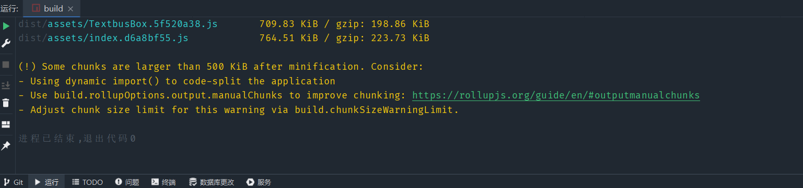

# 工作室汇报
> 2022.10.26 by belikers
# [huiindex](https://www.hjh0819.com/)
> 已搭建到腾讯云服务器且配置了https
> 
> **nginx**  **PM2**  **mysql**  **Redis**
### vite打包时遇到的问题（Textbus组件的css过大）

````typescript
export default defineConfig({
build: {
    chunkSizeWarningLimit: 1600,
    rollupOptions: {
      output: {
        manualChunks(id) {
          if (id.includes("node_modules")) {
            return id
              .toString()
              .split("node_modules/")[1]
              .split("/")[0]
              .toString();
          }
        },
      },
    },
  },
});
````
## [Ant Design Vue3组件库](https://www.antdv.com/docs/vue/introduce-cn) 
 与Element Plus差别不大的组件库。
本项目使用的是局部注册
- elementPlus
- Ant Design Vue
- [layui](https://www.layuiweb.com/index.htm)
## [vite3](https://vitejs.cn/vite3-cn/) [vite2](https://vitejs.cn/guide/)

### vite和webpack的底层语言对比

从底层原理上来说，Vite是基于esbuild预构建依赖。而esbuild是采用go语言编写，因为go语言的操作是纳秒级别，而js是以毫秒计数，所以vite比用js编写的打包器快10-100倍。


#### 下列在 v2 当中我们已经标记为弃用选项，现在已经被移除：

- alias（改为了 resolve.alias）
- dedupe（改为了 resolve.dedupe）
- build.base（改为了 base）
- build.brotliSize（改为了 build.reportCompressedSize）
- build.cleanCssOptions（Vite 现在使用 esbuild 来做 CSS 最小化压缩）
- build.polyfillDynamicImport（在没有支持动态导入的浏览器中，使用 @vitejs/plugin-legacy）
- optimizeDeps.keepNames（改为了 optimizeDeps.esbuildOptions.keepNames）
#### 开发服务器变化
  Vite 的默认开发服务器端口号现在改为了 5173。
  可以使用 server.port 将其设置为 3000。
Vite 的默认开发服务器主机地址现在改为了 localhost。
  在 Vite v2，Vite 默认监听的是 127.0.0.1。
  Node.js 在 v17 版本以下通常会解析 localhost 到 127.0.0.1，因此对这些版本，主机地址并未变更。
  若明确需要，对于 Node.js v17 版本以上，你可以使用 server.host、将其设置为 127.0.0.1。

现在 Vite v3 会打印出正确的主机地址。
这意味着使用 localhost 时 Vite 可能会打印 127.0.0.1 作为正在监听的地址。
可以设置 dns.setDefaultResultOrder('verbatim') 来避免这一表现。
#### 自动生成 https 证书
当使用 https 时需要一个合法可用的证书。在 Vite v2 中，
如果没有配置证书，Vite 会自动生成和缓存一个自签名的证书。 
从 Vite v3 开始，我们推荐手动创建你自己的证书。
如果你仍想要使用 v2 中的自动生成，
该功能可以通过添加 @vitejs/plugin-basic-ssl 
到项目插件中来实现。
```typescript
import basicSsl from '@vitejs/plugin-basic-ssl'
export default {
plugins: [basicSsl()]
}
```

## [dayjs](https://dayjs.fenxianglu.cn/) 
用于时间处理
## [lodash](https://www.lodashjs.com/) 
处理数据的JavaScript工具库
````
_.trim([string=''], [chars=whitespace])
````
从string字符串中移除前面和后面的 空格 或 指定的字符。
>例子
````typescript
_.trim('  abc  ');
// => 'abc'

_.trim('-_-abc-_-', '_-');
// => 'abc'

_.map(['  foo  ', '  bar  '], _.trim);
// => ['foo', 'bar']
````
## [Pinia](https://pinia.web3doc.top/)
### pinia和vuex的区别
- （1）它没有mutation,他只有state，getters，action【同步、异步】使用他来修改state数据
- （2）他默认也是存入内存中，如果需要使用本地存储，在配置上比vuex麻烦一点
- （3）语法上比vuex更容易理解和使用，灵活。
- （4）pinia没有modules配置，没一个独立的仓库都是definStore生成出来的
- （5）state是一个对象返回一个对象和组件的data是一样的语法
###   Vuex 和 Pinia 的优缺点
####   Vuex的优点
支持调试功能，如时间旅行和编辑
适用于大型、高复杂度的Vue.js项目
#### Vuex的缺点
从 Vue 3 开始，getter 的结果不会像计算属性那样缓存
Vuex 4有一些与类型安全相关的问题
#### Pinia的优点
**完整的 TypeScript 支持**：与在 Vuex 中添加 TypeScript 相比，添加 TypeScript 更容易
极其轻巧（体积约 1KB）
store 的 action 被调度为常规的函数调用，而不是使用 dispatch 方法或 MapAction 辅助函数，这在 Vuex 中很常见
支持多个Store
支持 Vue devtools、SSR 和 webpack 代码拆分
#### Pinia的缺点
不支持时间旅行和编辑等调试功能
## [Textbus](https://textbus.io/)
富文本编辑组件
`````vue
<template>
  <div ref="editorContainer"></div>
</template>
<script>
import { defineComponent, ref, onMounted } from 'vue'
import { createEditor } from '@textbus/editor';
import '@textbus/editor/bundles/textbus.min.css';

export default defineComponent({
setup() {
const editorContainer = ref();
onMounted(() => {
const editor = createEditor();
editor.mount(editorContainer.value)
editor.onChange.subscribe(() => {
console.log(editor.getContents());
});
})

    return {
      editorContainer
    }
}
})
</script>
`````
# 代码规范
## 注释
```` javascript 
/**
* 函数名
* @param 传入参数
* @param 传入参数
* @return 返回值
  */
````
## [ESlint](https://eslint.bootcss.com/)+[Prettier](https://www.prettier.cn/)
用于js/ts和vue的代码规范和自动更正

特别是TypeScript,eslint会自动修正变量的类型或者自动添加为设置变量的类型，还能直接将js代码格式化成ts代码

JetBrains对eslint和prettier完美适配
> [git学习网站](https://www.liaoxuefeng.com/wiki/896043488029600)
> 
> 搭配JetBrains自带的git工具使用
> 
## [自制Vue3+Vite+TypeScript+Eslint+Prettier初始化模板](https://github.com/belikers/local) by hjh
由于使用的vite，不会像用vue-cli构建的vue项目那样
能一键引入常用依赖的配置
>package.json
````json

{
  "name": "app",
  "description": "app",
  "private": true,
  "version": "0.0.0",
  "scripts": {
    "dev": "vite",
    "build": "vue-tsc --noEmit && vite build",
    "preview": "vite preview"
  },
  "dependencies": {
    "pinia": "^2.0.14",
    "pinia-plugin-persistedstate": "^1.6.1",
    "vue": "^3.2.25",
    "vue-router": "4"
  },
  "devDependencies": {
    "@types/lodash": "^4.14.182",
    "@types/node": "^18.6.4",
    "@typescript-eslint/eslint-plugin": "^5.23.0",
    "@typescript-eslint/parser": "^5.23.0",
    "@vitejs/plugin-vue": "^2.3.3",
    "eslint": "^8.15.0",
    "eslint-config-prettier": "^8.5.0",
    "eslint-config-standard": "^17.0.0",
    "eslint-plugin-import": "^2.26.0",
    "eslint-plugin-n": "^15.2.0",
    "eslint-plugin-prettier": "^4.0.0",
    "eslint-plugin-promise": "^6.0.0",
    "eslint-plugin-vue": "^8.7.1",
    "prettier": "^2.7.1",
    "typescript": "^4.6.4",
    "unplugin-vue-components": "^0.21.1",
    "vite": "^3.1.8",
    "vue-tsc": "^0.38.4"
  }
}

````
## vue3+vite+ts+eslint+prettier
### 创建项目

`yarn create vite`

### 配置ESlint
创建完项目之后，本身并不支持ESlint，需要我们自己配置，首先安装eslint

`yarn add eslint -D`

安装完之后我们需要配置eslint，一般情况下在项目根目录建一个eslintrc.js，或者用eslint指令进行初始化来创建,

##### 初始化

`eslint --init`

按照提示我们依次选择以下几个主要选项
````
? How would you like to use ESLint? ...
To check syntax only
To check syntax and find problems
> To check syntax, find problems, and enforce code style


? What type of modules does your project use? ...
> JavaScript modules (import/export)
CommonJS (require/exports)
None of these


? Which framework does your project use? ...
React
> Vue.js
None of these


? Does your project use TypeScript? » No / Yes
选择推荐风格，这里我们直接选第一个跟着引导去选择aribn或者standard

> Use a popular style guide
Answer questions about your style
Inspect your JavaScript file(s)
````
选择完后，需要安装一些eslint相关的依赖包，默认是用npm安装，安装完会自动生成一个eslintrc.js

依赖包
个人感觉用npm比较慢，如果你想更快，可以取消，并且复制它推荐的那些依赖包，用yarn安装，但是这样一来将不会自动生成eslintrc.js文件，需要你自己去配置写一份eslintrc.js文件
````
yarn add eslint-plugin-vue@latest @typescript-eslint/eslint-plugin@latest eslint-config-standard@latest eslint@^7.12.1 eslint-plugin-import@^2.22.1 eslint-plugin-node@^11.1.0 eslint-plugin-promise@^4.2.1 @typescript-eslint/parser@latest -D
````
- eslint-plugin-vue@latest
- @typescript-eslint/eslint-plugin@latest
- eslint-config-standard@latest
- eslint@^7.12.1
- eslint-plugin-import@^2.22.1
- eslint-plugin-node@^11.1.0
- eslint-plugin-promise@^4.2.1
- @typescript-eslint/parser@latest

自动生成的eslintrc.js

extends 的顺序后面会覆盖前面，prettier必须在最后，
````
module.exports = {
"env": {
"browser": true,
"es2021": true,
"node": true
},
"extends": [
"plugin:vue/essential",
"standard",
"prettier"
],
"parserOptions": {
"ecmaVersion": 12,
"parser": "@typescript-eslint/parser",
"sourceType": "module"
},
"plugins": [
"vue",
"@typescript-eslint"
],
"rules": {
}
}
````
此为止我们的eslint安装完毕，下面我们需要让他支持vue 和 ts, 我们来继续修改eslintrc.js文件
我们的项目需要支持vue 和 ts，所以这里我们直接用官方推荐的插件和配置就行了，前面初始化eslint 选项的时候，就已经自动安装了相关依赖包 [eslint-plugin-vue] 和 @typescript-eslint/parser

````
{
parser: 'vue-eslint-parser',
extends: [
'plugin:vue/vue3-recommended',
'plugin:@typescript-eslint/recommended',
'standard'
]
}
````
### 配置prettier
##### 安装prettier

`yarn add prettier -D`

##### 解决 eslint 和 prettier 冲突
安装 eslint-config-prettier

##### 解决 ESLint 中的样式规范和 prettier 中样式规范的冲突，以 prettier 的样式规范为准，使 ESLint 中的样式规范自动失效
>eslint-plugin-prettier

eslint-plugin-prettier插件会调用prettier对你的代码风格进行检查，其原理是先使用prettier对你的代码进行格式化，然后与格式化之前的代码进行对比，如果过出现了不一致，这个地方就会被prettier进行标记。
接下来，我们需要在rules中添加，"prettier/prettier": "error"，表示被prettier标记的地方抛出错误信息。

````
//.eslintrc.js
{
"plugins": ["prettier"],
"rules": {
"prettier/prettier": "error"
}
}
````


项目下新建 .prettierrc.json 文件


````
module.exports = {
tabWidth: 2,
jsxSingleQuote: true,
jsxBracketSameLine: true,
printWidth: 100,
singleQuote: true,
semi: false,
overrides: [
{
files: '*.json',
options: {
printWidth: 200,
},
},
],
arrowParens: 'always',
}

````
项目下新建 .prettierignore


````
# 忽略格式化文件 (根据项目需要自行添加)
node_modules
dist


package.json 配置:

{
"script": {
"lint": "eslint src --fix --ext .ts,.tsx,.vue,.js,.jsx",
"prettier": "prettier --write ."
}
}
````

上面配置完成后,可以运行以下命令测试下代码检查个格式化效果:
````
# eslint 检查
yarn lint
# prettier 自动格式化
yarn prettier
````

prettier cli 指令

格式化路径下文件

`npx prettier -w .`

检查路径下文件是否格式化

`npx prettier -c .`
