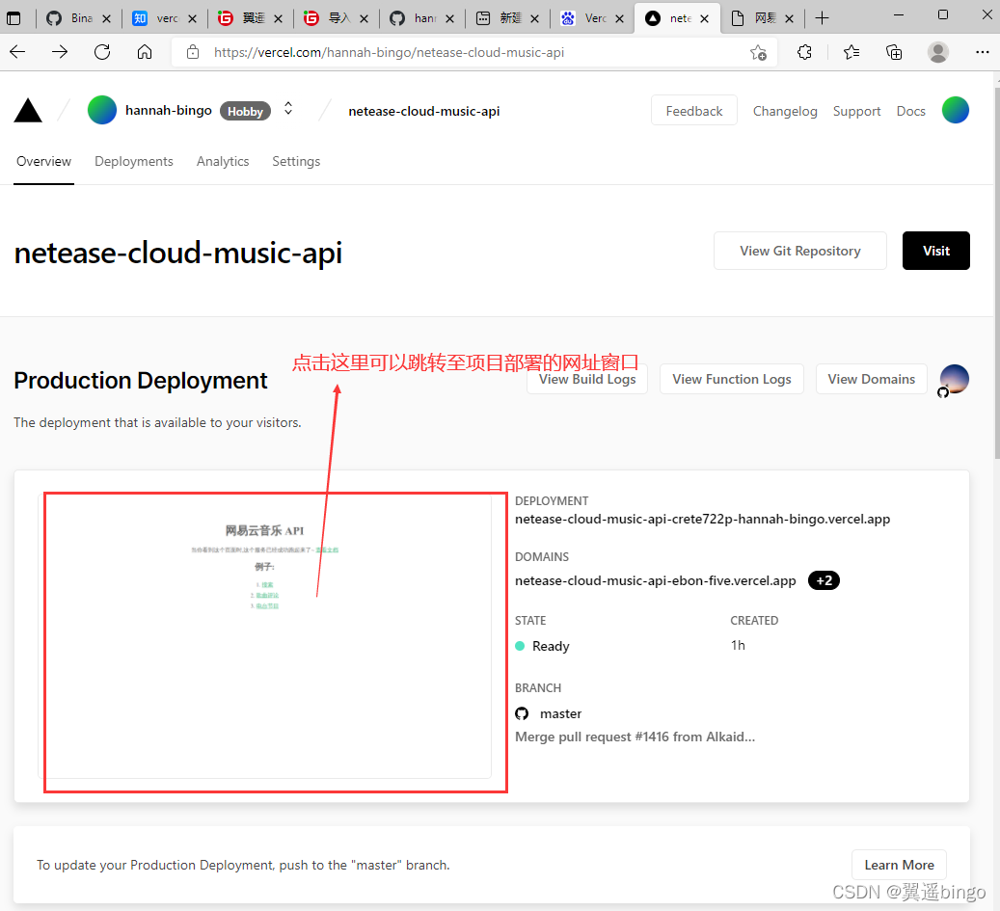
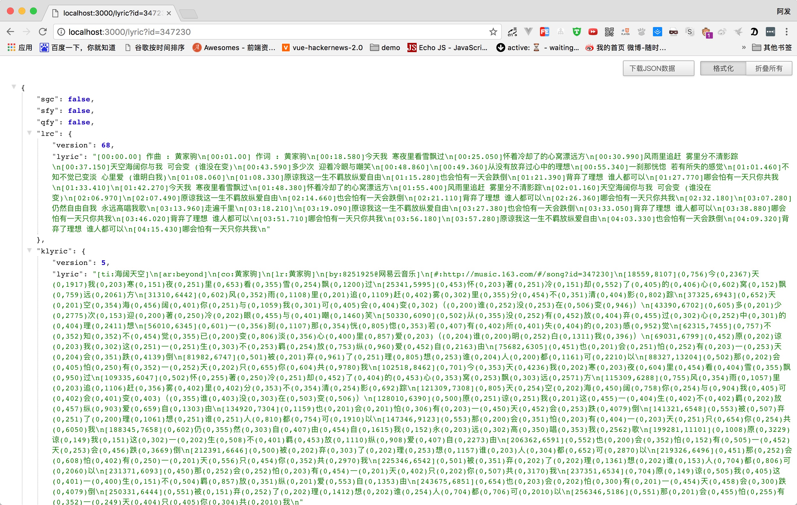

# 工作室汇报
> 2022.11.16 by belikers

# vue3

> UI库/相关工具/可视化/生态全分享

## 1.Web UI库

### 1.   ElementUI Plus

一套为开发者、设计师和产品经理准备的基于 Vue 3.0 的桌面端组件库
https://element-plus.org/zh-CN/

https://element-plus.gitee.io/zh-CN/

### 2.    Ant Design of Vue

Ant Design 的 Vue 实现，开发和服务于企业级后台产品
https://www.antdv.com/docs/vue/introduce-cn

表单方面

### 3.    ~~BalmUI~~

基于谷歌的 Material Design，附带 Vue 插件和指令，以及从简单到复杂的高度可定制组件
https://next-material.balmjs.com/

### 4.    Naive UI

图森Vue3的组件库，文档完整，有超过 80 个组件，Naive UI 全量使用 TypeScript 编写，不需要导入任何 CSS 就能让组件正常工作

https://www.naiveui.com/zh-CN/os-theme

> Naive Ui Admin 是基于 `vue3`,`vite2`,`TypeScript`，搭配使用 [Naive Ui]([Naive UI](https://link.zhihu.com/?target=https%3A//www.naiveui.com/)) 组件库形成一套开箱即用的中后台前端解决方案，Naive Ui Admin 遵守 Naive Ui 组件设计和开发约定，风格统一，全面的组件和便捷的工具会让您信手拈来，如鱼得水，更多功能在不停开发中。
>
> https://www.naiveadmin.com/

### 5.    arco.design

字节跳动企业级产品设计系统，支持React和Vue双版本
https://arco.design/

>  区别[设计规范ArcoDesign和AntDesign有何不同-经验/观点-UICN用户体验设计平台](https://www.ui.cn/detail/635700.html)

### 6,     Quasar

轻松构建高性能和高质量的Vue.js 3用户界面，好用，但没有中文文档(完美兼容vite)
https://quasar.dev/

### 7.      iDUX

Vue3.x 的 UI 组件库，完全使用 TypeScript 开发
https://idux.site/

> 表单，复合搜索，高级文本域，高级穿梭框，高级表格，高级树型控件

### 8.     TDesign

腾讯业务团队在服务业务过程中沉淀的一套企业级设计体系
https://tdesign.tencent.com/
https://tdesign.tencent.com/vue-next/overview

### 9.      PrimeVue

易于使用、多功能、高性能的 Vue UI 组件库
https://www.primefaces.org/primevue/

### 10.    DevUI

华为基于 Vue3 和 DevUI 设计的 UI 组件
https://vue-devui.github.io/

### 11.     vuestic-ui

Vue 3 的免费和开源 UI 库 ,UI非常好看，并且有可用后台管理界面。
https://vuestic.dev/

### 12.     Headless UI

完全无样式、完全可访问的 UI 组件，旨在与 Tailwind CSS 完美集成。
https://headlessui.com/

### 13.      View UI Plus

基于 Vue.js 3 的企业级 UI 组件库和前端解决方案
https://www.iviewui.com/

## 2.移动UI库

### 14.       Vant

有赞轻量、可靠的移动端组件库
https://vant-contrib.gitee.io/vant/#/zh-CN

### 15.      NutUI

京东风格的轻量级移动端 Vue 组件库，非常适合移动端电商使用。
https://nutui.jd.com/#/

### 16.     Varlet

Material 风格移动端组件库 ，文档非常齐全。
https://varlet.gitee.io/varlet-ui/#/zh-CN/home

### 17.       nutui-bingo

京东基于 NutUI 的抽奖组件库，助力营销活动和小游戏场景。
https://nutui.jd.com/bingo/#/

## 3.相关工具

### 18.      unplugin-vue-components

antfu 按需组件自动导入，开箱即用地支持 Vue 2 和 Vue 3，Tree-shakable，只注册你使用的组件，附有流行UI 库的内置解析器。
https://www.npmjs.com/package/unplugin-vue-components

### 19.      vuex-persistedstate

在页面重新加载之间保持并重载您的 Vuex 状态
https://github.com/robinvdvleuten/vuex-persistedstate

### 20.       vuex-persist

支持 Typescript 的Vuex插件，它能够将应用程序的状态保存到持久存储中，例如 Cookies 或 localStorage
https://championswimmer.in/vuex-persist/

### 21.      @vueuse/gesture

手势库，使应用程序具有交互性
https://gesture.vueuse.org/

### 22.      unplugin-auto-import

antfu 自动导入 Vite、Webpack、Rollup 和 esbuild 的 API。支持 TypeScript。
https://github.com/antfu/unplugin-auto-import

### 23.     pinia-plugin-persistedstate

Pinia 商店的可配置持久性
https://github.com/prazdevs/pinia-plugin-persistedstate

### 24.     https://vue-termui.dev/

一个基于 Vue.js 的终端 UI 框架，可让您轻松构建现代终端应用程序
https://vue-termui.dev/

## 4.可视化

### 25.    Pdfvuer

DF 查看器，使用 Mozilla 的 PDF.js，支持 Vue2 和 Vue3
https://arkokoley.github.io/pdfvuer/

### 26.      vue3-marquee

无缝滚动组件
https://vue3-marquee.vercel.app/

### 27.     Vue-ECharts

百度ECharts 的 Vue.js 组件。 配置参考Echarts官方 基于 ECharts v5+ 开发，适用于Vue.js 2/3。
https://vue-echarts.dev/

### 28.     iconpark

字节跳动出品，将一个SVG图标转化为多个主题，并生成React图标，Vue图标，svg图标
https://iconpark.oceanengine.com/home

## 5.插件

### 29.    vue-multiselect-next

Vue.js 的通用选择/多选/标记组件
https://vue-multiselect.js.org/

### 30.     vue-print-nb

用于印刷、简单、快速、方便、轻便的指令包装器
https://github.com/Power-kxLee/vue-print-nb

### 31.      vue-i18n-next

Vue3的国际化插件
https://vue-i18n.intlify.dev/

### 32.     vue-cropper

简单的vue图片裁剪插件
http://github.xyxiao.cn/vue-cropper/example/

### 33.     Vue Grid Layout

Vue.js 的网格布局系统
https://jbaysolutions.github.io/

### 34.     Vue Qrcode Reader

允许在不离开浏览器的情况下检测和解码二维码
https://gruhn.github.io/vue-qrcode-reader/

### 35.     Makeit Captcha

基于 Vue3 + Vite + Canvas 开发的滑块验证码，动态生成验证滑块，结合后端的二次校验，能有效的避免被抓取模拟验证https://admin.makeit.vip/components/captcha

### 36.     vue3-clipboard

Vue 3 的 clipboard.js
https://github.com/soerenmartius/vue3-clipboard

### 37.       vue.draggable

基于Sortable.js的Vue 3拖放组件
https://sortablejs.github.io/vue.draggable.next/#/simple

### 38.        BetterScroll

解决移动端（已支持 PC）各种滚动场景需求的插件。
https://better-scroll.github.io/docs/zh-CN/

## 6.相关生态

### 39.    Vue 插件库

https://www.vue365.cn/

### 40.     Pinia

轻量级状态管理库，API 设计更接近Vuex 5的提案
https://pinia.vuejs.org/

### 41.     Nuxt Modules

Nuxt 发现我们的模块列表以增强您的Nuxt 项目
https://modules.nuxtjs.org/

### 42.      Nuxt 3

轻量级应用框架,可用来创建服务端渲染 (SSR) 应用
https://v3.nuxtjs.org/

### 43.      vuepress

Vue 驱动的静态网站生成器
https://v2.vuepress.vuejs.org/zh/

### 44.      VueUse

强大的 Vue 组合实用程序集合
https://vueuse.org/

## 7.动画

### 45.   vue-starport

带有动画的跨路由共享组件
https://vue-starport.netlify.app/

### 46.     @vueuse/motion

Vue Composables 让你的组件动起来
https://motion.vueuse.org/

## 8.音视频

### 47.   @vueuse/sound

用于播放音效的 Vue 组合
https://sound.vueuse.org/

*XMind: ZEN - Trial Version*

## [Vercel](https://vercel.com/)

>**vercel** 是一个站点托管平台，提供**CDN**加速，
>同类的平台有 **_Netlify_** 和 **_Github Pages_**，
>相比之下，vercel 国内的**访问速度更快**，
>并且提供Production环境和development环境，
>对于项目开发非常的有用的，并且支持持续集成，
>一次push或者一次PR会自动化构建发布，
>发布在development环境，
>都会生成不一样的链接可供预览。

但是vercel只是针对个人用户免费，teams是收费的
>首先vercel零配置部署，第二访问速度比github-page好很多，
> 并且构建很快，还是免费使用的，
> 对于部署个人前端项目路、接口服务非常方便

- vercel类似于github page，但远比github page强大，速度也快得多得多，而且将Github授权给vercel后，可以达到最优雅的发布体验，只需将代码轻轻一推，项目就自动更新部署了。
- vercel还支持部署serverless接口。那代表着，其不仅仅可以部署静态网站，甚至可以部署动态网站，而这些功能，统统都是免费的
- vercel还支持自动配置https，不用自己去FreeSSL申请证书，更是省去了一大堆证书的配置
- vercel目前的部署模板有31种之多

### 使用Vercel搭建网易云API接口

-  打开[Vercel官网](https://vercel.com/)
-  登录之后点击`New Project`
-  点击 `Import Git Repository` 并选择项目并点击`import`
-  进入如下页面默认点击`Deploy`即可




## github搜索

> in:name java
> in:readme 电商 stars:>1000 language:java

## [网易云音乐API](https://binaryify.github.io/NeteaseCloudMusicApi/#/?id=neteasecloudmusicapi)

github:[Binaryify/NeteaseCloudMusicApi: 网易云音乐 Node.js API service (github.com)](https://github.com/Binaryify/NeteaseCloudMusicApi)

### 进行组件的拆分：

- Header 头部
- Footer 底部
- Banner 横幅滚动图
- Loading 加载区
- Login 注册
- Play-bar 播放条
- ......

### 分析所需要的依赖

- axios
- element-ui
- element-plus
- vuex
- vue-router
- less

### 所需要完成的效果

- [x] 获取轮播图
- [x] 获取热榜
- [x] 登录
- [x] 退出登入
- [ ] 获取个人信息
- [ ] 歌单
- [ ] 歌手页
- [x] 搜索
- [x] 热门搜索
- [ ] Mv
- [x] 获取歌曲信息
- [x] 歌单评论
- [x] 相似歌曲
- [ ] 

#### 二维码登录

说明: 二维码登录涉及到 3 个接口,调用务必带上时间戳,防止缓存

##### 1. 二维码 key 生成接口

说明: 调用此接口可生成一个 key

**接口地址 :** `/login/qr/key`

##### 2. 二维码生成接口

说明: 调用此接口传入上一个接口生成的 key 可生成二维码图片的 base64 和二维码信息,可使用 base64 展示图片,或者使用二维码信息内容自行使用第三方二维码生成库渲染二维码

必选参数: `key`,由第一个接口生成

可选参数: `qrimg` 传入后会额外返回二维码图片 base64 编码

**接口地址 :** `/login/qr/create`

**调用例子 :** `/login/qr/create?key=xxx`

##### 3. 二维码检测扫码状态接口

说明: 轮询此接口可获取二维码扫码状态,800 为二维码过期,801 为等待扫码,802 为待确认,803 为授权登录成功(803 状态码下会返回 cookies)

必选参数: `key`,由第一个接口生成

**接口地址 :** `/login/qr/check`

**调用例子 :** `/login/qr/check?key=xxx`

调用可参考项目文件例子`/public/qrlogin.html` (访问地址:http://localhost:3000/qrlogin.html)

#### 获取歌曲详情

说明 : 调用此接口 , 传入音乐 id(支持多个 id, 用 `,` 隔开), 可获得歌曲详情(dt为歌曲时长)

**必选参数 :** `ids`: 音乐 id, 如 `ids=347230`

**接口地址 :** `/song/detail`

**调用例子 :** `/song/detail?ids=347230`,`/song/detail?ids=347230,347231`

返回字段说明:

```
name: String, 歌曲标题
id: u64, 歌曲ID
pst: 0，功能未知
t: enum,
  0: 一般类型
  1: 通过云盘上传的音乐，网易云不存在公开对应
    如果没有权限将不可用，除了歌曲长度以外大部分信息都为null。
    可以通过 `/api/v1/playlist/manipulate/tracks` 接口添加到播放列表。
    如果添加到“我喜欢的音乐”，则仅自己可见，除了长度以外各种信息均为未知，且无法播放。
    如果添加到一般播放列表，虽然返回code 200，但是并没有效果。
    网页端打开会看到404画面。
    属于这种歌曲的例子: https://music.163.com/song/1345937107
  2: 通过云盘上传的音乐，网易云存在公开对应
    如果没有权限则只能看到信息，但无法直接获取到文件。
    可以通过 `/api/v1/playlist/manipulate/tracks` 接口添加到播放列表。
    如果添加到“我喜欢的音乐”，则仅自己可见，且无法播放。
    如果添加到一般播放列表，则自己会看到显示“云盘文件”，且云盘会多出其对应的网易云公开歌曲。其他人看到的是其对应的网易云公开歌曲。
    网页端打开会看到404画面。
    属于这种歌曲的例子: https://music.163.com/song/435005015
ar: Vec<Artist>, 歌手列表
alia: Vec<String>,
  别名列表，第一个别名会被显示作副标题
  例子: https://music.163.com/song/536623501
pop: 小数，常取[0.0, 100.0]中离散的几个数值, 表示歌曲热度
st: 0: 功能未知
rt: Option<String>, None、空白字串、或者类似`600902000007902089`的字符串，功能未知
fee: enum,
  0: 免费或无版权
  1: VIP 歌曲
  4: 购买专辑
  8: 非会员可免费播放低音质，会员可播放高音质及下载
  fee 为 1 或 8 的歌曲均可单独购买 2 元单曲
v: u64, 常为[1, ?]任意数字, 代表歌曲当前信息版本
version: u64, 常为[1, ?]任意数字, 代表歌曲当前信息版本
crbt: Option<String>, None或字符串表示的十六进制，功能未知
cf: Option<String>, 空白字串或者None，功能未知
al: Album, 专辑，如果是DJ节目(dj_type != 0)或者无专辑信息(single == 1)，则专辑id为0
dt: u64, 歌曲时长
sq: Option<Quality>, 无损质量文件信息
h: Option<Quality>, 高质量文件信息
m: Option<Quality>, 中质量文件信息
l: Option<Quality>, 低质量文件信息
a: Option<?>, 常为None, 功能未知
cd: Option<String>, None或如"04", "1/2", "3", "null"的字符串，表示歌曲属于专辑中第几张CD，对应音频文件的Tag
no: u32, 表示歌曲属于CD中第几曲，0表示没有这个字段，对应音频文件的Tag
rtUrl: Option<String(?)>, 常为None, 功能未知
rtUrls: Vec<String(?)>, 常为空列表, 功能未知
djId: u64,
  0: 不是DJ节目
  其他：是DJ节目，表示DJ ID
copyright: u32, 0, 1, 2: 功能未知
s_id: u64, 对于t == 2的歌曲，表示匹配到的公开版本歌曲ID
mark: u64, 功能未知
originCoverType: enum
  0: 未知
  1: 原曲
  2: 翻唱
originSongSimpleData: Option<SongSimpleData>, 对于翻唱曲，可选提供原曲简单格式的信息
single: enum,
  0: 有专辑信息或者是DJ节目
  1: 未知专辑
noCopyrightRcmd: Option<NoCopyrightRcmd>, None表示可以播，非空表示无版权
mv: u64, 非零表示有MV ID
rtype: 常为0，功能未知
rurl: Option<String(?)>, 常为None，功能未知
mst: u32, 偶尔为0, 常为9，功能未知
cp: u64, 功能未知
publishTime: i64, 毫秒为单位的Unix时间戳
pc: 云盘歌曲信息，如果不存在该字段，则为非云盘歌曲
```

#### 获取音乐 url - 新版

说明 : 使用注意事项同上

**必选参数 :** `id` : 音乐 id `level`: 播放音质等级, 分为 `standard` => `标准`,`higher` => `较高`, `exhigh`=>`极高`, `lossless`=>`无损`, `hires`=>`Hi-Res`

**接口地址 :** `/song/url/v1`

**调用例子 :** `/song/url/v1?id=33894312&level=exhigh` `/song/url/v1?id=405998841,33894312&level=lossless`

#### 音乐是否可用

说明: 调用此接口,传入歌曲 id, 可获取音乐是否可用,返回 `{ success: true, message: 'ok' }` 或者 `{ success: false, message: '亲爱的,暂无版权' }`

**必选参数 :** `id` : 歌曲 id

**可选参数** : `br`: 码率,默认设置了 999000 即最大码率,如果要 320k 则可设置为 320000,其他类推

**接口地址 :** `/check/music`

**调用例子 :** `/check/music?id=33894312`

#### 获取歌词

说明 : 调用此接口 , 传入音乐 id 可获得对应音乐的歌词 ( 不需要登录 )

**必选参数 :** `id`: 音乐 id

**接口地址 :** `/lyric`

**调用例子 :** `/lyric?id=33894312`


#### 歌单评论

说明 : 调用此接口 , 传入音乐 id 和 limit 参数 , 可获得该歌单的所有评论 ( 不需要 登录 )

**必选参数 :** `id`: 歌单 id

**可选参数 :** `limit`: 取出评论数量 , 默认为 20

`offset`: 偏移数量 , 用于分页 , 如 :( 评论页数 -1)*20, 其中 20 为 limit 的值

`before`: 分页参数,取上一页最后一项的 `time` 获取下一页数据(获取超过 5000 条评论的时候需要用到)

**接口地址 :** `/comment/playlist`

**调用例子 :** `/comment/playlist?id=705123491`

#### banner

说明 : 调用此接口 , 可获取 banner( 轮播图 ) 数据

**可选参数 :**

`type`:资源类型,对应以下类型,默认为 0 即 PC

```
0: pc

1: android

2: iphone

3: ipad
```

**接口地址 :** `/banner`

**调用例子 :** `/banner`, `/banner?type=2`

#### 搜索

说明 : 调用此接口 , 传入搜索关键词可以搜索该音乐 / 专辑 / 歌手 / 歌单 / 用户 , 关键词可以多个 , 以空格隔开 , 如 " 周杰伦 搁浅 "( 不需要登录 ), 可通过 `/song/url` 接口传入歌曲 id 获取具体的播放链接

**必选参数 :** `keywords` : 关键词

**可选参数 :** `limit` : 返回数量 , 默认为 30 `offset` : 偏移数量，用于分页 , 如 : 如 :( 页数 -1)*30, 其中 30 为 limit 的值 , 默认为 0

`type`: 搜索类型；默认为 1 即单曲 , 取值意义 : 1: 单曲, 10: 专辑, 100: 歌手, 1000: 歌单, 1002: 用户, 1004: MV, 1006: 歌词, 1009: 电台, 1014: 视频, 1018:综合, 2000:声音(搜索声音返回字段格式会不一样)

**接口地址 :** `/search` 或者 `/cloudsearch`(更全)

**调用例子 :** `/search?keywords=海阔天空` `/cloudsearch?keywords=海阔天空`

##### 默认搜索关键词

说明 : 调用此接口 , 可获取默认搜索关键词

**接口地址 :** `/search/default`

##### 热搜列表(简略)

说明 : 调用此接口,可获取热门搜索列表

**接口地址 :** `/search/hot`

**调用例子 :** `/search/hot`

##### 热搜列表(详细)

说明 : 调用此接口,可获取热门搜索列表

**接口地址 :** `/search/hot/detail`

**调用例子 :** `/search/hot/detail`

##### 搜索建议

说明 : 调用此接口 , 传入搜索关键词可获得搜索建议 , 搜索结果同时包含单曲 , 歌手 , 歌单信息

**必选参数 :** `keywords` : 关键词

**可选参数 :** `type` : 如果传 'mobile' 则返回移动端数据

**接口地址 :** `/search/suggest`

**调用例子 :** `/search/suggest?keywords=海阔天空` `/search/suggest?keywords=海阔天空&type=mobile`

##### 搜索多重匹配

说明 : 调用此接口 , 传入搜索关键词可获得搜索结果

**必选参数 :** `keywords` : 关键词

**接口地址 :** `/search/multimatch`

**调用例子 :** `/search/multimatch?keywords=海阔天空`
