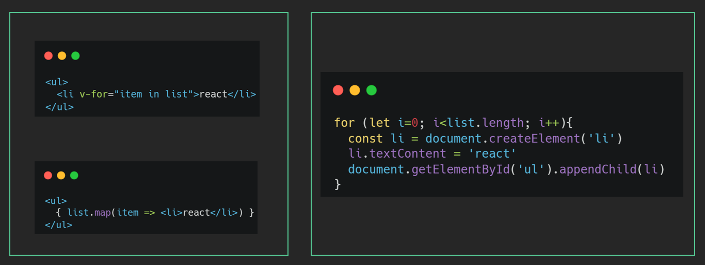

# 工作室汇报
> 2022.12.07 by belikers

# React基础
## React介绍
> 目标任务:  了解什么是React以及它的特点

### React是什么
一个专注于构建用户界面的 JavaScript 库，和vue和angular并称前端三大框架，不夸张的说，react引领了很多新思想，世界范围内是最流行的js前端框架，最近发布了18版本，加入了很多新特性
- React英文文档（https://reactjs.org/）
- React中文文档 （https://zh-hans.reactjs.org/）
- React新文档	（https://beta.reactjs.org/）（开发中....）
### React有什么特点
1. 声明式UI（JSX）
> 写UI就和写普通的HTML一样，抛弃命令式的繁琐实现
 
  
2. 组件化
> 组件是react中最重要的内容，组件可以通过搭积木的方式拼成一个完整的页面，通过组件的抽象可以增加复用能力和提高可维护性
 
  
3. 跨平台
> react既可以开发web应用也可以使用同样的语法开发原生应用（react-native），比如安卓和ios应用，甚至可以使用react开发VR应用，想象力空间十足，react更像是一个 元框架  为各种领域赋能 

## 环境初始化
> 目标任务:   能够独立使用React脚手架创建一个react项目
### 使用脚手架创建项目

#### 安装

全局安装
````bash
npm i -g create-react-app
````
#### 初始化

````bash
create-react-app my-app
````
my-app 表示项目名称，可以修改。

####  启动项目
````bash
yarn start
````
or
````bash
 npm start
````
### 项目目录说明调整
   -  目录说明

   a. `src` 目录是我们写代码进行项目开发的目录

   b. `package.json`  中俩个核心库：`react `、`react-dom`
   -  目录调整

   a. 删除`src`目录下自带的所有文件，只保留`app.js`根组件和`index.js`

   b. 创建`index.js`文件作为项目的入口文件，在这个文件中书写`react`代码即可
   -  入口文件说明
````jsx
   import React from 'react'
   import ReactDOM from 'react-dom'
   import './index.css'
   // 引入根组件App
   import App from './App'
   // 通过调用ReactDOM的render方法渲染App根组件到id为root的dom节点上
   ReactDOM.render(
   <React.StrictMode>
   <App />
   </React.StrictMode>,
   document.getElementById('root')
   )
 ````
## JSX基础
### JSX介绍
#### 概念：JSX是 JavaScript XML（HTML）的缩写，表示在 JS 代码中书写 HTML 结构
#### 作用：在React中创建HTML结构（页面UI结构）
#### 优势：
- 采用类似于HTML的语法，降低学习成本，会HTML就会JSX
- 充分利用JS自身的可编程能力创建HTML结构

> 注意：JSX 并不是标准的 JS 语法，是 JS 的语法扩展，浏览器默认是不识别的，脚手架中内置的 @babel/plugin-transform-react-jsx 包，用来解析该语法


### JSX中使用js表达式
   语法
   `{ JS 表达式 }`
````
   const name = 'hjh'

<h1>你好,我叫 {name} </h1>   //    <h1>你好,我叫hjh</h1>
````
可以使用的表达式

1. 字符串、数值、布尔值、null、undefined、object（ [] / {} ）
2. 1 + 2、'abc'.split('')、['a', 'b'].join('-')
3. fn()

**特别注意**
> if 语句/ switch-case 语句/ 变量声明语句，这些叫做语句，不是表达式，不能出现在 `{}`中！！

### JSX列表渲染
   页面的构建离不开重复的列表结构，比如歌曲列表，商品列表等，我们知道vue中用的是v-for，react这边如何实现呢？

实现：使用数组的`map` 方法
````jsx
// 来个列表
const songs = [
{ id: 1, name: '痴心绝对' },
{ id: 2, name: '像我这样的人' },
{ id: 3, name: '南山南' }
]

function App() {
return (
<div className="App">
<ul>
{
songs.map(item => <li>{item.name}</li>)
}
</ul>
</div>
)
}

export default App
````

> 注意点：需要为遍历项添加 key 属性

1. key 在 HTML 结构中是看不到的，是 React 内部用来进行性能优化时使用
2. key 在当前列表中要唯一的字符串或者数值（String/Number）
3. 如果列表中有像 id 这种的唯一值，就用 id 来作为 key 值
4. 如果列表中没有像 id 这种的唯一值，就可以使用 index（下标）来作为 key 值

### JSX条件渲染

#### 作用：根据是否满足条件生成HTML结构，比如Loading效果
#### 实现：可以使用 三元运算符 或   逻辑与(&&)运算符
````jsx
// 来个布尔值
const flag = true
function App() {
return (
<div className="App">
{/* 条件渲染字符串 */}
{flag ? 'react真有趣' : 'vue真有趣'}
{/* 条件渲染标签/组件 */}
{flag ? <span>this is span</span> : null}
</div>
)
}
export default App
````
### JSX样式处理

-  行内样式 - style
````jsx
function App() {
return (
<div className="App">
<div style={{ color: 'red' }}>this is a div</div>
</div>
)
}

export default App
````
-  行内样式 - style - 更优写法
````jsx
const styleObj = {
color:red
}

function App() {
return (
<div className="App">
<div style={ styleObj }>this is a div</div>
</div>
)
}

export default App
````
●  类名 - className（推荐）
````css
.title {
font-size: 30px;
color: blue;
}
````
●  类名 - className - 动态类名控制
````jsx
import './app.css'
const showTitle = true
function App() {
return (
<div className="App">
<div className={ showTitle ? 'title' : ''}>this is a div</div>
</div>
)
}
export default App
````
### JSX注意事项

1. JSX必须有一个根节点，如果没有根节点，可以使用`<></>`（幽灵节点）替代
2. 所有标签必须形成闭合，成对闭合或者自闭合都可以
3. JSX中的语法更加贴近JS语法，属性名采用驼峰命名法 ` class -> className`  ` for -> htmlFor`
4. JSX支持多行（换行），如果需要换行，需使用() 包裹，防止bug出现
